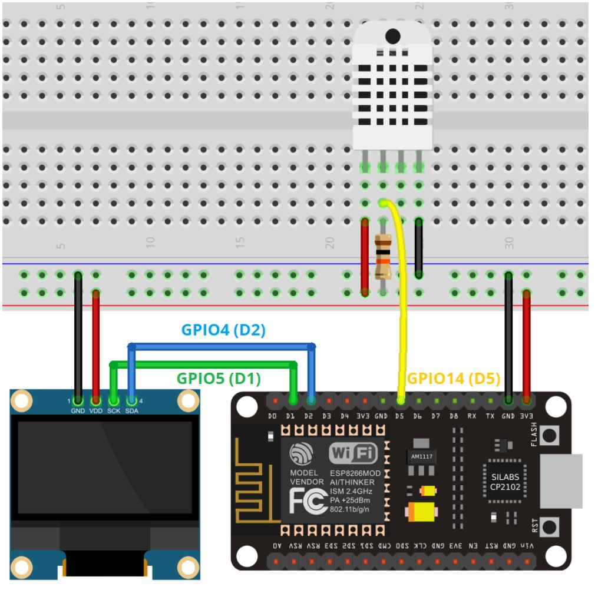
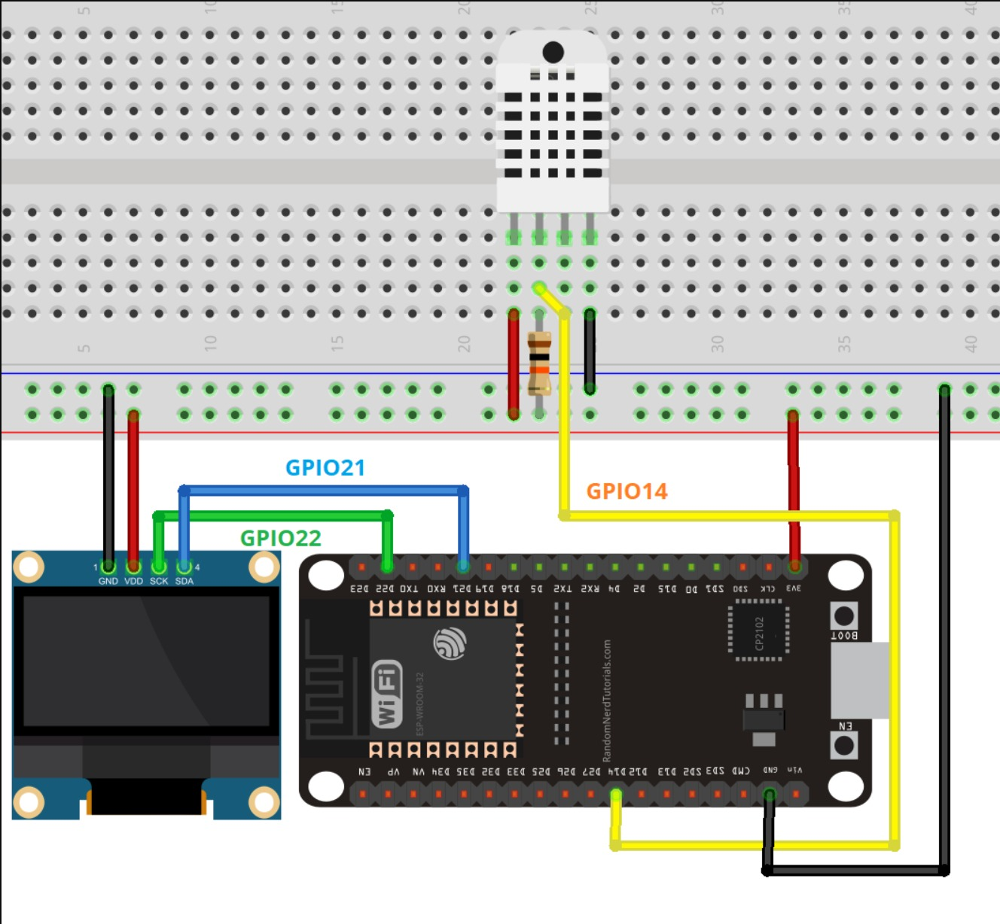

# Guida all'Assemblaggio del Circuito

Questo documento contiene tutte le informazioni necessarie per assemblare fisicamente il monitor di temperatura e umidità. 

## Componenti Necessari

*   **Microcontrollore:** ESP8266 (es. NodeMCU) oppure ESP32.
*   **Sensore:** DHT11 o DHT22 (il DHT22 è consigliato per maggiore precisione e range più ampio).
*   **Display:** OLED 0.96 pollici I2C (SSD1306).
*   **Varie:** Breadboard e cavetti jumper.
*   **Resistenza (Opzionale):** Una resistenza di pull-up da 10kΩ. *Nota: necessaria solo se stai usando il sensore nudo (a 4 pin). Se usi un modulo DHT saldato su una basetta (a 3 pin), la resistenza è già integrata.*

## Schemi di Collegamento

Di seguito gli schemi visivi per il cablaggio. 

*(Aggiungi qui le immagini del tuo circuito, sostituendo i link con i percorsi corretti)*

*Figura 1: Schema di collegamento per ESP8266.*

*Figura 2: Schema di collegamento per ESP32.*

## Istruzioni Passo Passo

### 1. Alimentazione Comune
*   Collega uno dei pin **3V3** (o 3.3V) della tua scheda ESP alla linea di alimentazione positiva (rossa) della breadboard. 
*   Collega un pin **GND** della scheda alla linea di terra (blu/nera) della breadboard.

### 2. Cablaggio del Display OLED (I2C)
*   Collega i pin di alimentazione dell'OLED: **VCC** alla linea 3.3V e **GND** alla linea GND.
*   **Se usi ESP8266:** Collega il pin **SCL** al **GPIO 5 (D1)** e il pin **SDA** al **GPIO 4 (D2)**.
*   **Se usi ESP32:** Collega il pin **SCL** al **GPIO 22** e il pin **SDA** al **GPIO 21**.

### 3. Cablaggio del Sensore DHT
*   Collega il pin **VCC** (o +) del DHT alla linea 3.3V e il pin **GND** (o -) alla linea GND.
*   Collega il pin **Data** (o Out) del sensore al **GPIO 14** del microcontrollore.
    *   *Nota per ESP8266:* Il GPIO 14 corrisponde al pin serigrafato come **D5** sulla NodeMCU.
    *   *Nota per ESP32:* Il GPIO 14 è serigrafato direttamente come **14** o **D14**.

### 4. Aggiunta della resistenza di pull-up (Solo se necessaria)
*   Se il tuo sensore DHT ha 4 piedini (senza PCB di supporto), devi aggiungere una resistenza da 10k Ohm.
*   Collegala a ponte tra il piedino di alimentazione (**VCC**) e il piedino dei dati (**Data**). 
*   Ignora il terzo piedino del sensore partendo da sinistra (è il pin non connesso - NC).

---

Una volta completato l'assemblaggio, alimenta la scheda via USB. Se il codice è stato caricato correttamente, il display mostrerà il logo o si accenderà dopo un paio di secondi mostrando i valori di temperatura e umidità in tempo reale!